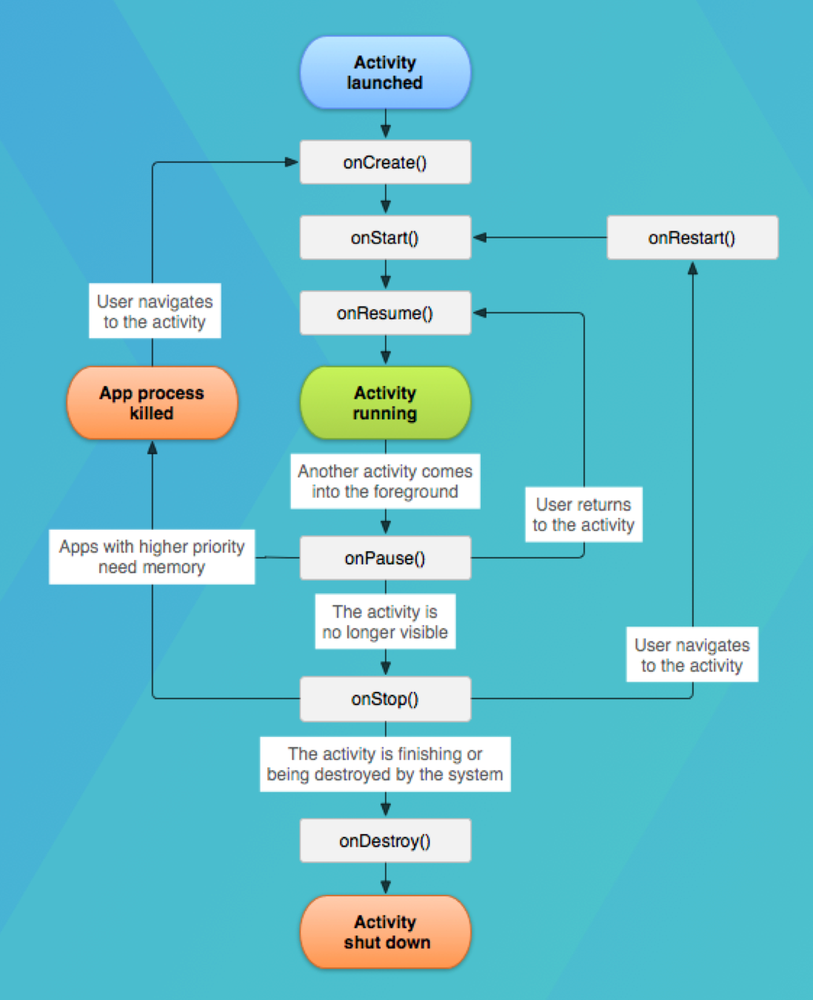

# Course 1



- `onCreate()` - initialize (caches, assets, etc.)
- `onStart()` - start the activity
- `onPause()` - persist what the user did (the content)
- `onResume()` - restore content
- `onStop()` - when not accessed for a long time
- `onRestart()` - restore the connections removed in `onStop()`

### HW
Try to override the rest of the functions in the exmaple

## Layouts

"R" object - generated at the compile time and contains references to all resources in the `res` folder (e.g., layouts, strings, drawables).

## Density pixels

It is better to use dp instead of px because it is device independent.


## Jetpack Compose

Main goal - ability to compose UI from small building blocks


### Example:
```kotlin
@Composable
fun Greeting(name: String) {
    Text(text = "Hello $name!")
}
```
- `@Composable` - annotation that tells the compiler that this function is used to describe part of the UI

### Basics
- row
- column
- box

